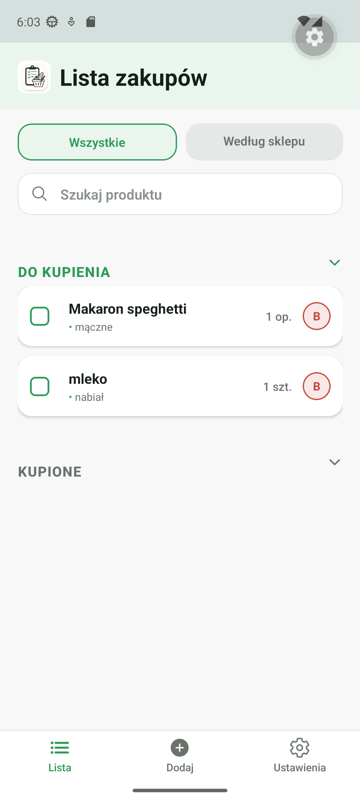
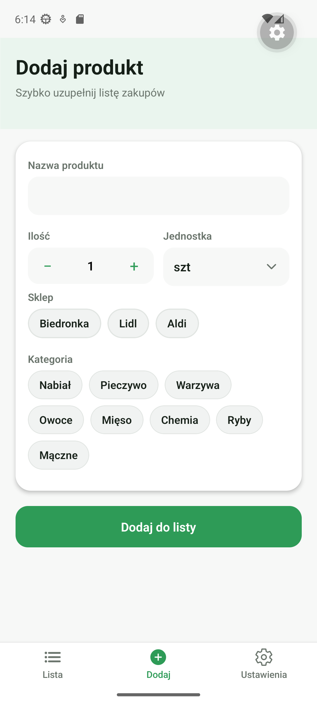
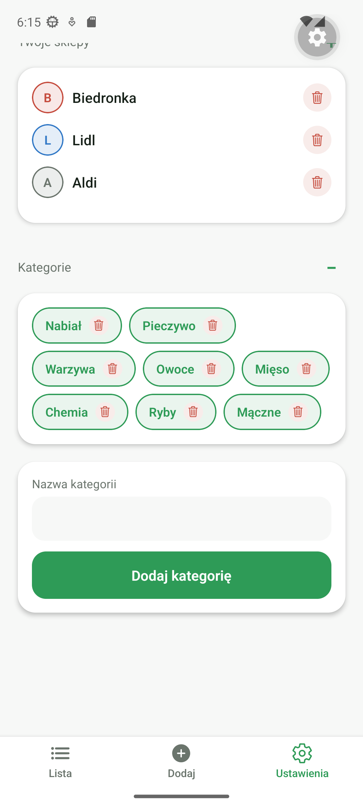
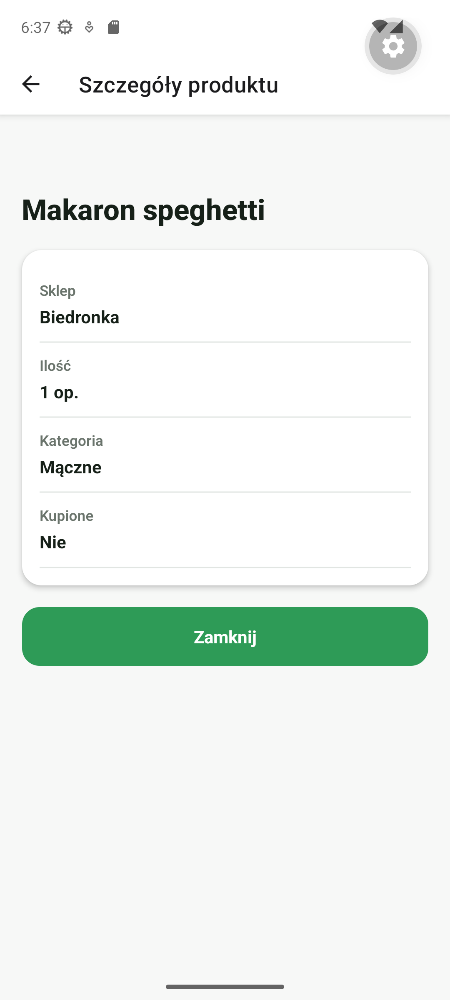

# Lista zakupów

Mobilna aplikacja do tworzenia listy zakupów. Produkty można dodawać do sklepów, oznaczać jako kupione, grupować według kategorii i wyszukiwać na liście.

## Screenshot






Kolejne zrzuty można dodać do katalogu `docs/screenshots`, np. `demo.gif`.

## Funkcje

- dodawanie produktów z nazwą, sklepem, kategorią, ilością i jednostką,
- jednostki: `szt`, `kg`, `op.`,
- zmiana ilości produktu z listy,
- oznaczanie produktów jako kupione,
- usuwanie produktów przez przesunięcie wiersza,
- widok wszystkich produktów,
- widok według sklepów i kategorii,
- wyszukiwanie produktów,
- zarządzanie sklepami i kategoriami,
- udostępnianie listy zakupów,
- zapis danych lokalnie w `AsyncStorage`,
- obsługa małych ekranów i orientacji poziomej.

## Technologie

- React Native,
- Expo,
- Expo Router,
- TypeScript,
- Context API,
- AsyncStorage,
- Expo Haptics,
- React Native Gesture Handler,
- React Native Keyboard Aware Scroll View,
- Lucide React Native,
- Jest,
- ESLint,
- Prettier.

## Funkcje natywne urządzenia

Aplikacja używa kilku funkcji telefonu:

- `AsyncStorage` - zapisuje listę produktów, sklepy i kategorie w pamięci urządzenia. Dzięki temu dane zostają po zamknięciu aplikacji.
- `Expo Haptics` - daje krótką wibrację po ważnych akcjach, np. dodaniu produktu, usunięciu produktu albo oznaczeniu jako kupione.
- `Share` z React Native - otwiera systemowe okno udostępniania, żeby można było wysłać listę zakupów np. w wiadomości.

Te funkcje nie wymagają osobnych uprawnień od użytkownika. Dlatego aplikacja nie pokazuje okna z prośbą o dostęp. Gdyby później była dodana kamera, lokalizacja albo powiadomienia, trzeba byłoby dodać obsługę zgody i odmowy użytkownika.

## Operacje asynchroniczne

Aplikacja używa `async/await` przy pracy z pamięcią telefonu.

- Przy starcie aplikacja wczytuje produkty, sklepy i kategorie z `AsyncStorage`.
- W czasie wczytywania pokazuje stan `Ładowanie...`.
- Przy zapisie pokazuje krótki komunikat `Zapisywanie...`.
- Po poprawnym zapisie pokazuje `Zapisano`.
- Jeśli odczyt albo zapis się nie uda, aplikacja pokazuje komunikat błędu.

Za tę logikę odpowiada `src/context/ShoppingContext.tsx`. Sam zapis i odczyt jest w pliku `src/services/shoppingStorage.ts`.

## Nawigacja

Aplikacja używa Expo Router.

- `Stack` jest w pliku `src/app/_layout.tsx`.
- `Tabs` są w pliku `src/app/(tabs)/_layout.tsx`.
- Główne zakładki to: lista, dodawanie produktu i ustawienia.
- Ekran `product-details` otwiera się jako modal ze stacka.
- Po kliknięciu produktu aplikacja przekazuje do modala parametry: nazwę, sklep, ilość, jednostkę, kategorię i informację, czy produkt jest kupiony.

To spełnia wymaganie dwóch typów nawigacji: `stack` + `tabs`. Modal szczegółów działa jako dodatkowy ekran w stacku.

## Wydajność

W aplikacji są zastosowane proste optymalizacje:

- Główna lista używa `SectionList`, więc React Native nie renderuje od razu wszystkich produktów.
- `SectionList` ma ustawione `initialNumToRender`, `maxToRenderPerBatch`, `windowSize` i `removeClippedSubviews`.
- Wiersz produktu `ProductRow` jest opakowany w `React.memo`, żeby nie odświeżać niepotrzebnie każdego wiersza.
- Główne akcje na produkcie używają `useCallback`.
- Filtrowanie, sekcje listy, mapa kolorów sklepów i grupowanie produktów są liczone przez `useMemo`.
- Widok według sklepów renderuje produkty dopiero po rozwinięciu sklepu albo podczas wyszukiwania.

Najważniejsze miejsca: `src/app/(tabs)/index.tsx` i `src/components/shopping/ProductRow.tsx`.

## Styl i UI/UX

Aplikacja nie używa gotowej biblioteki UI. Zamiast tego ma własne spójne komponenty i własny theme.

- Kolory, promienie zaokrągleń i odstępy są w `src/constants/theme.ts`.
- Główne komponenty UI to `ProductRow`, `SearchBar` i `ShoppingTabs`.
- Ekrany używają tych samych kolorów: zielony dla akcji, czerwony dla usuwania, jasne tło i białe karty.
- Przyciski, pola formularza, chipy i karty mają podobne odstępy oraz zaokrąglenia.

Wygląd aplikacji jest dzięki temu spójny, a zmiana koloru w przyszłości wymaga edycji jednego pliku z theme.

## Obsługa stanu aplikacji

Aplikacja używa Context API, bo stan jest potrzebny w kilku ekranach, ale projekt nie jest na tyle duży, żeby wymagał Redux Toolkit albo Zustand.

W globalnym stanie są dane używane przez całą aplikację:

- lista zakupów,
- sklepy,
- kategorie,
- stan ładowania i zapisu,
- błędy zapisu albo odczytu,
- akcje dodawania, usuwania i edycji produktów.

Stan lokalny zostaje w ekranach, jeśli dotyczy tylko jednego widoku:

- tekst wyszukiwania na ekranie listy,
- aktywna zakładka listy,
- rozwinięte sekcje,
- pola formularza dodawania produktu,
- otwarte formularze w ustawieniach.

Dzięki temu globalny stan nie jest przeładowany, a ekrany nadal są proste do czytania.

## Obsługa błędów

Aplikacja obsługuje błędy w kilku miejscach:

- błędy wczytywania i zapisu danych z `AsyncStorage`,
- błędy udostępniania listy,
- puste sytuacje, np. brak produktów do usunięcia,
- błędy renderowania przez `ErrorBoundary`.

Przy błędzie wczytywania danych użytkownik widzi komunikat i przycisk `Spróbuj ponownie`. `ErrorBoundary` pokazuje prosty ekran awaryjny, jeśli któryś widok nie wyrenderuje się poprawnie.

Aplikacja nie wykonuje zapytań sieciowych, więc `NetInfo` nie jest obecnie potrzebne. Dane są zapisywane lokalnie na urządzeniu.

## Tryb offline

Aplikacja działa bez internetu.

- Produkty, sklepy i kategorie są zapisywane lokalnie w `AsyncStorage`.
- Po ponownym uruchomieniu aplikacja wczytuje dane z pamięci telefonu.
- Dodawanie, usuwanie i oznaczanie produktów jako kupione działa offline.
- Aplikacja nie pobiera danych z API, więc nie wymaga połączenia z siecią.

Pełna synchronizacja offline-online nie jest potrzebna, bo dane nie są wysyłane na serwer.

## Bezpieczeństwo

Aplikacja nie przechowuje danych wrażliwych.

- Nie ma logowania, haseł, tokenów ani płatności.
- Nie ma kluczy API zapisanych w kodzie.
- Dane nie są wysyłane na serwer.
- Aplikacja nie komunikuje się z własnym API, więc nie ma ryzyka wysyłania danych przez niezabezpieczone połączenie.
- `AsyncStorage` jest używany tylko do zwykłych danych aplikacji: produktów, sklepów i kategorii.

Gdyby w przyszłości aplikacja przechowywała tokeny, hasła albo inne dane wrażliwe, trzeba byłoby użyć `expo-secure-store` zamiast `AsyncStorage`.

Formularze mają podstawową walidację:

- nie można dodać produktu bez nazwy i sklepu,
- nie można dodać sklepu albo kategorii bez nazwy,
- aplikacja blokuje duplikaty sklepów i kategorii,
- wartości tekstowe są czyszczone przez `trim()`.

## Wymagania

Przed uruchomieniem trzeba mieć:

- Node.js,
- npm,
- Android Studio z emulatorem Androida albo Expo Go na telefonie.

## Uruchomienie

1. Zainstaluj zależności:

   ```bash
   npm install
   ```

2. Uruchom projekt:

   ```bash
   npm start
   ```

3. Wybierz sposób uruchomienia:
   - `a` - Android emulator,
   - `w` - przeglądarka,
   - zeskanuj kod QR w Expo Go.

Można też od razu uruchomić Androida:

```bash
npm run android
```

## Testy i jakość kodu

Uruchom testy:

```bash
npm test
```

Uruchom ESLint:

```bash
npm run lint
```

Sprawdź TypeScript:

```bash
npx tsc --noEmit
```

Sformatuj kod Prettierem:

```bash
npm run format
```

## Struktura projektu

```text
src/
  app/                 ekrany aplikacji
  components/shopping/ komponenty widoku listy zakupów
  context/             globalny stan aplikacji
  services/            zapis i odczyt danych
  types/               typy TypeScript
  utils/               logika filtrowania i grupowania
```

## Najważniejsze pliki

- `src/context/ShoppingContext.tsx` - główny stan listy zakupów,
- `src/services/shoppingStorage.ts` - zapis danych w pamięci telefonu,
- `src/utils/shoppingSelectors.ts` - filtrowanie, sekcje i grupowanie,
- `src/components/shopping/ProductRow.tsx` - wiersz produktu,
- `src/utils/__tests__/shoppingSelectors.test.ts` - testy logiki aplikacji.

## Testowane scenariusze

Projekt ma 10 testów jednostkowych. Testy sprawdzają:

- wyszukiwanie produktów,
- filtrowanie po nazwie,
- usuwanie pustych sekcji,
- budowanie sekcji `Do kupienia` i `Kupione`,
- zachowanie zwiniętych sekcji,
- grupowanie produktów według kategorii,
- kategorię `Inne`.

## Uwagi dla oceniającego

Aplikacja używa Context API do zarządzania stanem. Logika zapisu danych, filtrowania i grupowania jest wydzielona do osobnych plików. Dzięki temu kod jest łatwiejszy do czytania i testowania.
